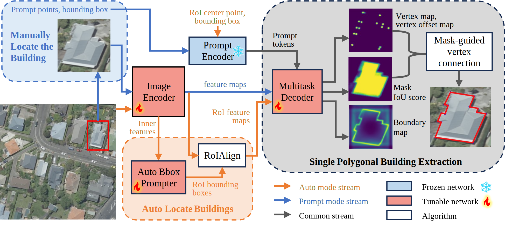
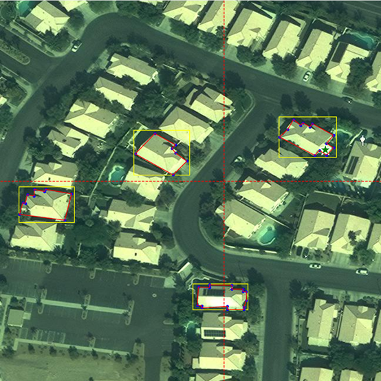

# SAMPolyBuild
This repository is the code implementation of the paper ["SAMPolyBuild: Adapting the Segment Anything Model (SAM) for Polygonal Building Extraction"](https://www.sciencedirect.com/science/article/abs/pii/S0924271624003563) accepted by ISPRS Journal of Photogrammetry and Remote Sensing. 



## Installation
Conda virtual environment is recommended for installation. Please choose the appropriate version of torch and torchvision according to your CUDA version.
Run the following commands or run the 'install.sh' script.
```shell
conda create -n sampoly python=3.10 -y
source activate sampoly # or conda activate sampoly
pip install torch==2.0.0+cu117 torchvision==0.15.1+cu117 --index-url https://download.pytorch.org/whl/cu117
pip install -r requirements.txt
cd pycocotools
pip install .
```
Download the SAM vit_b model from [here](https://dl.fbaipublicfiles.com/segment_anything/sam_vit_b_01ec64.pth) and place it in the 'segment_anything' folder.


## Inference
### Prompt mode
You can use the trained model prompt_interactive.pth from [Baidu Cloud](https://pan.baidu.com/s/1ak-nA032Mf342QHXD8JNug?pwd=8a0q) / [Google Drive](https://drive.google.com/file/d/1meU9SCnXxwAuTYkK0GRtrzRsnAYDgG6B/view?usp=drive_link) to predict the building polygons on the images. Change the **args.imgpth** to the corresponding image path and specify the bounding box prompt coordinates in the **bbox** and prompt point coordinates in the **prompt_point** (selectable).
```shell
python infer_poly_crop.py
```
If you run the code with GUI environment, you can use the following code to interactively select the bounding box and prompt points. Follow the instructions in the terminal to click the bounding box, prompt points (selectable) and generate the polygon.
```shell
python interactive_prompt.py
```


### Auto mode
You can use the trained model auto_whumix.pth from [Baidu Cloud](https://pan.baidu.com/s/1s6aWDZ77t8Bt-aIHiEG9Gw?pwd=6wqn) / [Google Drive](https://drive.google.com/file/d/1VNyUl2CtV19NqxLhnE4LFw32VUvOD0J9/view?usp=drive_link) to predict the building polygons on the images. Change the **args.img_dir** to the image directory that contains the images you want to predict, and the **args.img_suffix** to the corresponding image suffix.
```shell
python infer_auto.py
```
Show the predicted polygons and masks on the images (change the img_dir, dt_pth and img_suffix):
```shell
python utils/show_pred.py
```
## Dataset Preparation
### SpaceNet Vegas Dataset
We converted the original images of the SpaceNet dataset to 8-bit and the annotations to coco format, and divided them into training, validation, and test sets in the ratio of 8:1:1, which are available for download from [here](https://aistudio.baidu.com/datasetdetail/269168). Place the train, val, test folders in the 'dataset/spacenet' folder.
### WHU-mix (vector) dataset
The WHU-mix dataset can be download from [here](http://gpcv.whu.edu.cn/data/whu-mix%20(vector)/whu_mix(vector).html). Place the train, val, test1 and test2 folders in the 'dataset/whu_mix' folder, and run the preprocess code:
```shell
cd dataset
python preprocess.py
```

### Custom Dataset
The custom dataset should be in the following format, or change the **train_dataset_pth**, **val_dataset_pth** in the train.py and **dataset_pth** in the test.py to the corresponding path.
```
dataset
├── dataset_name
    ├── train
    |    ├── images
    |    ├── ann.json
    ├── val
    |    ├── images
    |    ├── ann.json
    ├── test
        ├── images
        ├── ann.json
```

## Training
### Prompt mode
Single gpu:
```shell
python train.py --config configs/prompt_instance_spacenet.json --gpus 0
```
Multi gpus:
```shell
python train.py --config configs/prompt_instance_spacenet.json --gpus 0 1 --distributed
```
### Auto mode
First pretrain the model with the full-image feature input (the default method of the SAM) in prompt mode.
```shell
python train.py --config configs/prompt_fullimg_spacenet.json
```
Then load the model and train the auto mode. Change the pretrain_chkpt in the auto_spacenet.py to the path of the pretrained model.
```shell
python train_auto.py --config configs/auto_spacenet.py
```

## Testing
### Prompt mode
Evaluate the model on the test set, and save the results:
```shell
python test.py
```
You need to change the **--task_name** to the corresponding training task name, and the other arguments will be set automatically according to training configuration.

If you want to use our trained model to evaluate, you can download prompt_instance_spacenet.pth from [Baidu Cloud](https://pan.baidu.com/s/1xQ3tKt2mOv55O0g3J-EJvQ?pwd=dz5d) / [Google Drive](https://drive.google.com/file/d/1pQ_1HmUfCpJ_c6LZ3qcvbhabH6CpBgp4/view?usp=drive_link) and change the following code in the test.py:
```python
args = load_args(parser,path='configs/prompt_instance_spacenet.json')
args.checkpoint = 'prompt_instance_spacenet.pth'
```
### Auto mode
Set the **config** and **ckpt_path** args to the corresponding configuration and checkpoint path, and run the test.
```shell
python test_auto.py --config configs/auto_spacenet.py --ckpt_path work_dir/spacenet_auto/version_0/checkpoints/last.ckpt
```
You can download the trained model auto_spacenet.pth from [Baidu Cloud](https://pan.baidu.com/s/1AIvaoI-hM0Ecd94S_sag4w?pwd=in3k) / [Google Drive](https://drive.google.com/file/d/1oJ2Pmip3B60lFSStIOeoAwnG0__YK29-/view?usp=drive_link) and test directly.
```shell
python test_auto.py --config configs/auto_spacenet.py --ckpt_path auto_spacenet.pth
```
For the WHU-mix dataset, you can download the trained model auto_whumix.pth from [Baidu Cloud](https://pan.baidu.com/s/1s6aWDZ77t8Bt-aIHiEG9Gw?pwd=6wqn) / [Google Drive](https://drive.google.com/file/d/1VNyUl2CtV19NqxLhnE4LFw32VUvOD0J9/view?usp=drive_link) and test directly.

For test2:
```shell
python test_auto.py --config configs/auto_whumix.py --ckpt_path auto_whumix.pth --gt_pth dataset/whu_mix/test2/ann.json
```
For test1: (change **test2** in configs/data_whu_mix.py to **test1**)
```shell
python test_auto.py --config configs/auto_whumix.py --ckpt_path auto_whumix.pth --gt_pth dataset/whu_mix/test1/ann.json --score_thr 0.3
```
## Acknowledgement
This project is developed based on the [Segment Anything Model (SAM)](https://github.com/facebookresearch/segment-anything)
 and [RSPrompter](https://github.com/KyanChen/RSPrompter) project. We thank the authors for their contributions.

## Citation
If you use the code of this project in your research, please refer to the bibtex below to cite SAMPolyBuild.
```
@article{wang2024sampolybuild,
  title={SAMPolyBuild: Adapting the Segment Anything Model for polygonal building extraction},
  author={Wang, Chenhao and Chen, Jingbo and Meng, Yu and Deng, Yupeng and Li, Kai and Kong, Yunlong},
  journal={ISPRS Journal of Photogrammetry and Remote Sensing},
  volume={218},
  pages={707--720},
  year={2024},
  publisher={Elsevier},
  doi = {10.1016/j.isprsjprs.2024.09.018}
}
```
## License

This project is licensed under the [Apache 2.0 license](LICENSE).

## Contact
If you have any questions, please contact wangchenhao22@mails.ucas.ac.cn.
